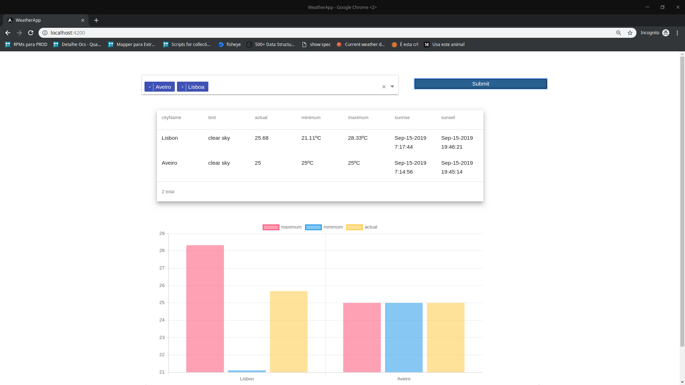

# Weather App
Fullstack web application where you can view the weather forecast for specific cities.

## Getting Started
After read this section you will be able to deploy the application. For this follow the instructions bellow:

* Execute the command "npm install" on both directories (weather-app and weather_rest_api);
* Change directory to weather_rest_api and execute "npm start";
* Change directory to weather-app and execute "ng serve";
* Go to http://localhost:4200/ on your browser.

## Prerequisites

To run this project on your computer you must have installed:

* Node.js:
** See how install Node.js on your computer [click here](https://nodejs.org/en/)

* Angular 8:
** Run the command "npm install -g @angular/cli"

## Example:
